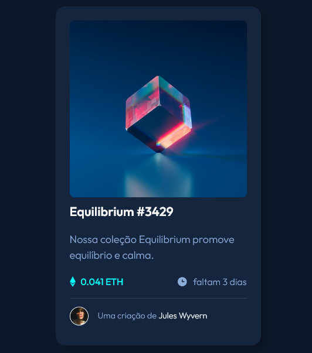

# CARTÃO DE COMPONENTE NTF

## Conteúdo

- [CARTÃO DE COMPONENTE NTF](#cartão-de-componente-ntf)
  - [Conteúdo](#conteúdo)
  - [Imagem](#imagem)
  - [Link GitPage](#link-gitpage)
  - [Construído com](#construído-com)
  - [Recursos](#recursos)

## Imagem

## Link GitPage

- GitPage: [Cartão de Componente NTF](https://github.com/MarcelaCostaA/card-ntf.git)

## Construído com 
- HTML semântico
- SCSS
- Flexbox

## Recursos 

- CSS GLOW GENERATOR (https://cssbud.com/css-generator/css-glow-generator/) - Para efeito de glow.
- CSS SHADOW GENERATOR (https://www.cssmatic.com/box-shadow) - Para efeito de shadow box.

Esta é uma solução para o [NFT preview card component challenge on Frontend Mentor](https://www.frontendmentor.io/challenges/nft-preview-card-component-SbdUL_w0U). 

